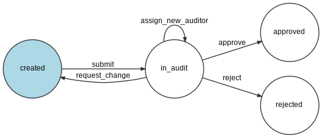

# contao-entity-approval-bundle

## Requirements
- PHP: ^7.4
- Contao: ^4.9

## Installation
composer require heimrichhannot/contao-entity-approval-bundle

## Features
- all entities can be configured for approval
- approval entities can only be set visible if approved
- admin can set visible without approval
- sends emails on entity status change or on transition
- unlimited approval steps 

## Workflow



for automatic creation of workflow diagram, just use the following command:

`vendor/bin/contao-console workflow:dump entity_approval | dot -Tpng -o vendor/heimrichhannot/contao-entity-approval-bundle/docs/img/approval-process.jpg`

### External Components
Symfony Workflow component: https://symfony.com/doc/current/components/workflow.html

Symfony String component: https://symfony.com/doc/current/components/string.html
## Configuration

All entities can be configured for approval workflow by setting it up in the config.yml.
Example below show a config for tl_submission entity(see option comments for more information)

### example config.yml
```yaml
huh_entity_approval:
  # Entity name( table name ) 
  tl_submission:
    # approval steps with options: 
    # ['name'] will be used to field names
    # ['groups'] is array of usergroups for approval in each step
    # ['mode'] is used for choosing of a user from groups : possible values (random, all)
    auditor_levels:
      - { name: "primary", groups: [ 10 ], mode: 'random' }
      - { name: "secondary", groups: [ 11,12,13,14,17,18 ], mode: 'random' }
    # entity field where the author email address is saved (used for notifications)
    author_email_field: email
    # notifications to be sent on state change or transition
    emails:
      auditor_changed_former: true
      auditor_changed_new: true
      state_changed_author: true
```
### Contao limitations
Some Entities will show approval fields after these fields are set visible in the entity archive settings (eg. tl_submission)

Usergroup permissions need to be set for every entity and approval field, to be displayed in the backend.

## Events
### PHP events

Events are fired as symfony events.

Event name                     | Description
------------------------------ | -----------
BeforeEntityGetModelEvent | Used to modify approval entity before display in Backend

