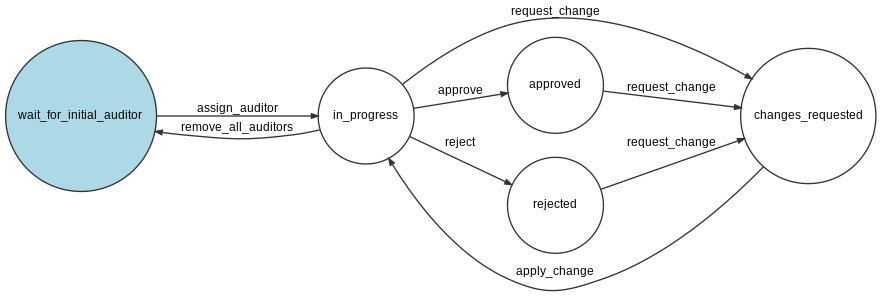

# contao-entity-approvement-bundle

## Workflow



### config.yml

```yaml
huh_entity_approvement:
  tl_submission:
    initial_auditor_groups: '1'
    auditor_groups: '1,2,6'
    initial_auditor_mode: 'random'
    publish_field: 'published'
    invert_publish_field: true
    emails:
      auditor_changed_former: true
      auditor_changed_new: true
      state_changed_author: true
```

`vendor/bin/contao-console workflow:dump entity_approvement | dot -Tpng -o vendor/heimrichhannot/contao-entity-approvement-bundle/docs/img/approvement-process.jpg`